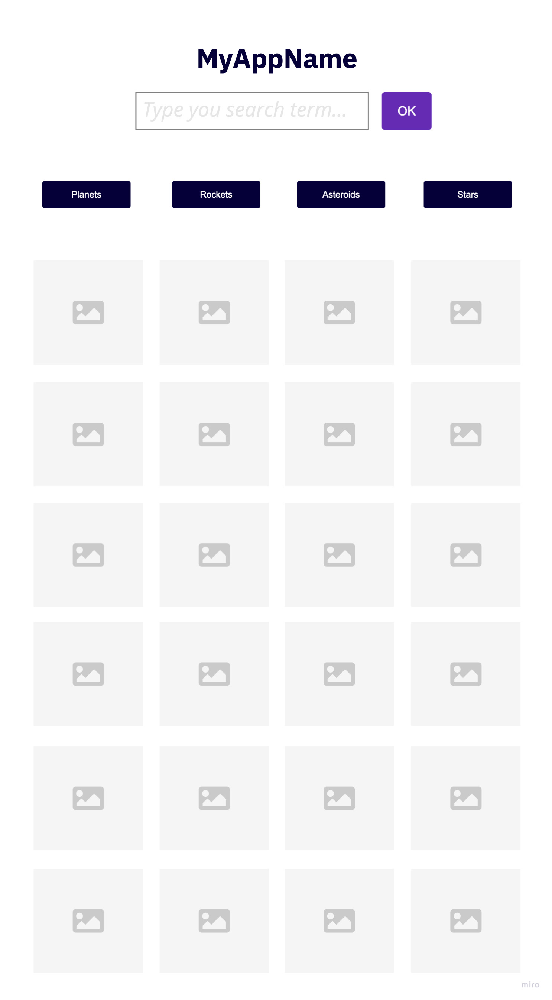

# What is required to complete the challenge

You are required to create a React App with an image gallery that interfaces with the Flickr API.
The application should be a single page that shows all images for a specific searched term.

# Business Requirements

We are looking for all of the requirements to be submitted. This is your chance to impress us, feel free to add any additional functionality or design.

## Features

### Search

  * User should be able to search for a term like "dog" or "cat" in a search field.
  * The page should show images based on this term from Flickr using Flickr API.
  * After every the search, the text in search box should be cleaned.
  * The user should be able to perform the search by clicking in a "Search" button or by pressing the "Enter" key.

### Image gallery

  * The gallery should never display more than 21 images/tiles per time.
  * The images should be displayed with the same sizes (same proportion for all images).
  * A hovered tile should implement a "zoom in" effect on the image.

### Pre defined suggestions

  * Underneath the search box there should be 4 pre defined terms that will immediately perform a search after being clicked.
  * The 4 pre-defirned terms should be "Planets", "Rockets", "Galaxies" and "Asteroids"

## We are going to check ...

  * Tests
  * Layout responsiviness
  * Code consistence
  * Project organization

# Design

Feel free to implement the design as you wish.
Below you can see an image for **INSPIRATION**.

# Resources

## Flickr API Documentation

https://www.flickr.com/services/api/

# Delivering your application

You may upload your app to a private or public repository in Github.

Send us the link for your repository which contains the application code to us via email.

If your repository is private, please add permission to view your project to the following users:

@renanborgez @indebanvdhamer @philipmendels
